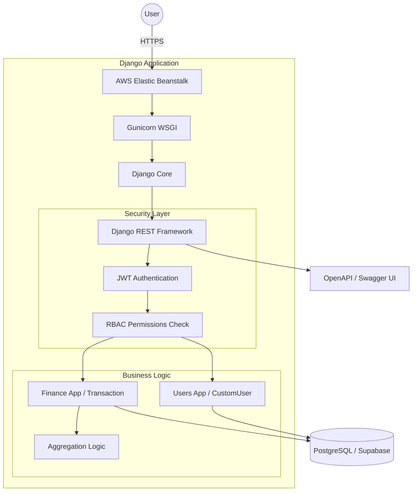
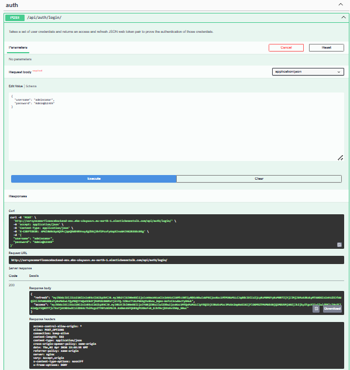
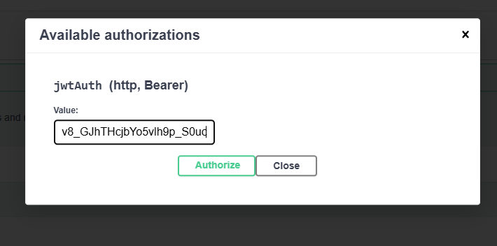
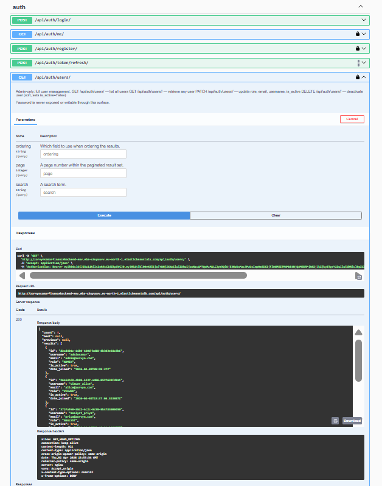
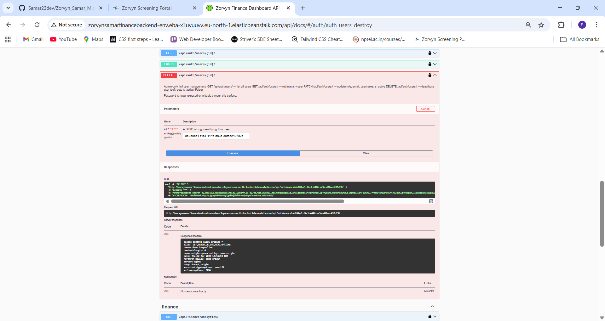
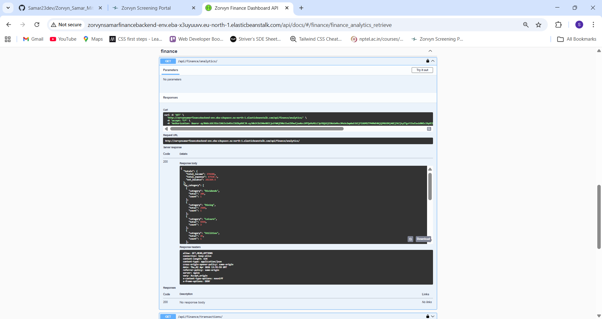
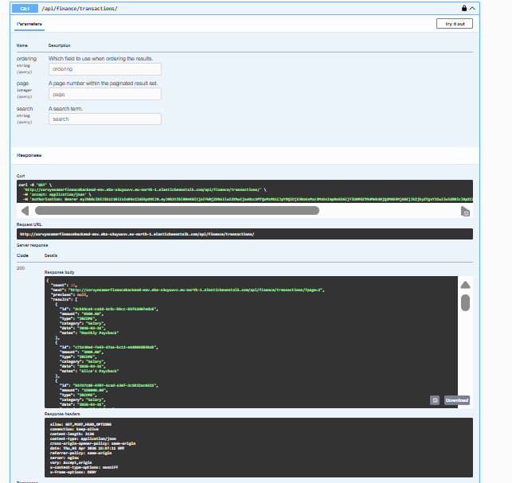
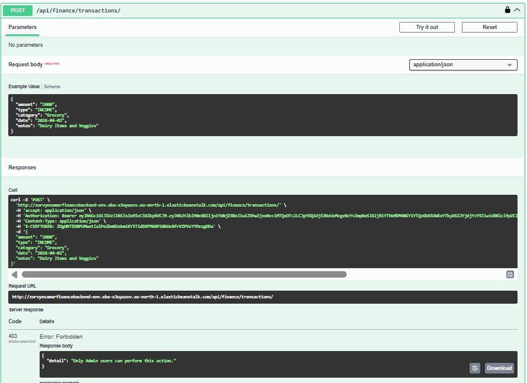
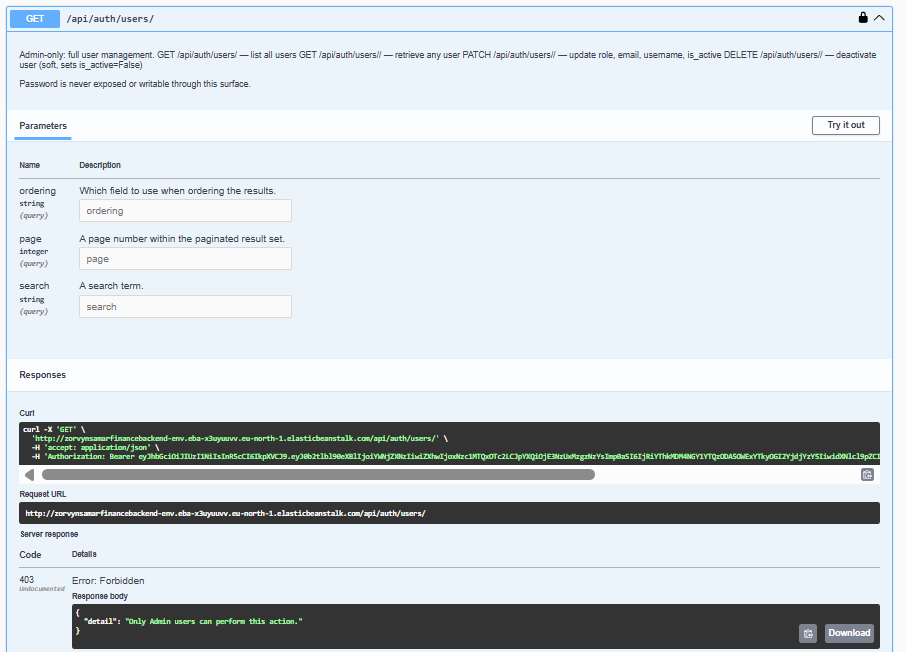
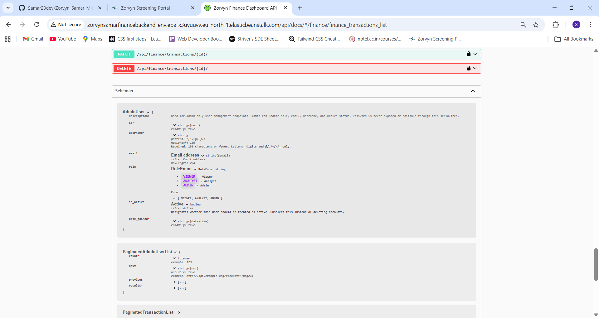

# Zorvyn Finance Dashboard — Backend API

> [!TIP]
> **Live API Documentation:** [Click here to view the live Swagger UI](http://zorvynsamarfinancebackend-env.eba-x3uyuuvv.eu-north-1.elasticbeanstalk.com/api/docs/)


## Developed By: Samar Mittal IIIT Pune
An enterprise-grade, Role-Based Finance Dashboard API built to securely manage user transactions, analytics, and permissions across different tiered roles. This repository was designed specifically to satisfy the requirements of advanced access-control logic, data persistence, and summary-level endpoints.

## 🏗️ System Architecture




---

## 🎯 How This Fulfills the Core Requirements

### 1. User and Role Management
The custom identity model (`CustomUser` extending `AbstractUser`) uses **UUIDs** for primary keys and implements a strict 3-tier Role-Based Access Control (RBAC) hierarchy:
- **Viewer**: Built for standard employees; can only interact with their own isolated data.
- **Analyst**: Has read-only access to global organization data and dashboard summaries.
- **Admin**: Has full CRUD capabilities over all transactions and all system users (`/api/auth/users/`).

### 2. Financial Records Management
The `finance` app implements a `Transaction` model featuring `amount`, `type` (INCOME/EXPENSE), `category`, `date`, and `notes`. 
- Supports full CRUD operations via the `/api/finance/transactions/` endpoint.
- Features powerful built-in filtering, allowing queries like: `/api/finance/transactions/?type=INCOME&category=Salary&ordering=-date`.

### 3. Dashboard Summary APIs
The `/api/finance/analytics/` endpoint aggregates real-time data directly in the database using Django ORM's `Sum` and `Count` annotations. It instantly calculates:
- Total Income vs. Total Expenses
- Net Balance
- Category-wise totals and transaction counts.

### 4. Access Control Logic (Middleware/Guards)
Access control is enforced at the view border using custom DRF `BasePermission` classes:
- `IsAdmin`: Blocks any non-admin from modifying transaction data or accessing user management.
- `IsAnalystOrAdmin`: Blocks standard viewers from seeing the global analytics endpoint.
- Data Isolation: The `get_queryset()` method acts as a persistent policy check. If a user is only a `Viewer`, the ORM forcibly injects a `user=request.user` clause, ensuring they can physically never query another user's data.

### 5. Validation and Error Handling
Strict validation is handled by DRF `ModelSerializers`. If incomplete or malformed data is sent (e.g., negative amounts disguised as strings, or an invalid UUID), the API correctly returns a `400 Bad Request` explicitly highlighting the failed field.

### 6. Data Persistence
The system utilizes a secure, pooled **PostgreSQL** relational database hosted on **Supabase** to ensure ACID compliance and high availability in production, integrated securely via environment variables (`python-decouple`).

---

## 🌟 Optional Enhancements Included

Going beyond the core requirements, this project implements multiple advanced features:
- **Token Authentication:** Stateless security utilizing JSON Web Tokens (JWT) via `djangorestframework-simplejwt`.
- **Soft Deletion Functionality:** When transaction or user data is deleted, it is never removed from PostgreSQL. Instead, custom `perform_destroy` controllers flag them as `is_deleted=True` or `is_active=False`, preserving the integrity of historical analytics.
- **Advanced Pagination:** All list endpoints globally enforce `PageNumberPagination` (20 items per page) to prevent payload overload.
- **Search & Filtering:** Direct text-search support via `SearchFilter` (e.g., `?search=paycheck`).
- **Unit Testing:** Secured by 12 comprehensive `APITestCase` modules testing authentication routing, data isolation constraints, and soft-deletion logic.
- **Automated API Documentation:** Fully interactive, dynamic **Swagger UI** generated natively via OpenAPI `drf-spectacular` schemas.

---

## 🚀 Live API Testing Guide

You can test the live production API immediately without any local setup using the **Swagger UI**.

### 🔐 Live Test Credentials (Indian Style Data)

Use any of these pre-seeded accounts to experience different system visibility:

| Role | Username | Password | Visibility |
|---|---|---|---|
| **Admin** | `adminsamar` | `Admin@12345` | Full organization CRUD + Summary |
| **Analyst** | `analyst_priya` | `AnalystPassword123!` | Global data analysis (read-only) |
| **Viewer** | `viewer_rahul` | `ViewerPassword123!` | Own transactions only (Ola/Uber) |
| **Viewer** | `viewer_amit` | `ViewerPassword123!` | Own transactions only (Leisure) |

> [!IMPORTANT]
> **Data Isolation Test**: 
> Log in as `viewer_rahul` and you will see ₹60,000 in income. 
> Log in as `adminsamar` and you will see a combined organization income of over ₹3,50,000. 
> Your backend automatically filters queries based on the authenticated token.

---

## 📸 Visual API Walkthrough

### 1. Core Authentication & User Onboarding
**User Registration (POST `/api/auth/register/`)**


**JWT Token Generation & Login**


---

### 2. Admin Capabilities
**Global User Management (Admin Only)**


**Soft Deactivation of Users**


---

### 3. Finance & Dashboard Summaries
**Real-time Analytics Aggregation**


**Paginated Transaction History**


---

### 4. Advanced Security (RBAC in Action)
**Analyst Restricted from Modifying Data**


**Analyst Restricted from User Management**


---

### 5. Automated Documentation
**Interactive Swagger UI Schema**


---

## 🛠️ Technology Stack
- **Framework:** Django 6.0.3 + Django REST Framework (DRF) 3.17
- **Database:** PostgreSQL (Supabase Cloud connected)
- **Deployment & Hosting:** AWS Elastic Beanstalk (Amazon Linux environments)
- **Server:** Gunicorn WSGI

---

## 🧪 Testing the Application
To run the automated DRF testing suite (verifying Role constraints and data mutations):

```bash
python manage.py test
```

---

## 🏁 Setup & Local Initialization

### 1. Environment Setup
Create a `.env` file in the root directory. To run locally without Supabase, configure a local database approach:

```env
SECRET_KEY=your-development-secret-key
DEBUG=True
ALLOWED_HOSTS=*

# Local Database Config (Example: SQLite for simplicity)
DB_ENGINE=django.db.backends.sqlite3
DB_NAME=db.sqlite3
```

### 2. Startup Script
```bash
# 1. Create and activate virtual environment
python -m venv venv
venv\Scripts\activate  # Windows

# 2. Install Dependencies
pip install -r requirements.txt

# 3. Apply Database Migrations
python manage.py migrate

# 4. Create an Admin user to log in
python manage.py createsuperuser

# 5. Start the Development Server
python manage.py runserver
```

---

## 📖 Complete API Reference

The interactive Swagger documentation is live at: [Live Swagger UI](http://zorvynsamarfinancebackend-env.eba-x3uyuuvv.eu-north-1.elasticbeanstalk.com/api/docs/) or `http://127.0.0.1:8000/api/docs/` when running locally.

| Method | URL | Auth | Description |
|---|---|---|---|
| POST | `/api/auth/register/` | None | Register new user (defaults to VIEWER) |
| POST | `/api/auth/login/` | None | Get JWT access + refresh tokens |
| POST | `/api/auth/token/refresh/` | None | Refresh access token |
| GET | `/api/auth/me/` | Bearer | Current user's own profile |
| GET | `/api/auth/users/` | Bearer + Admin | List all users |
| GET | `/api/auth/users/<id>/` | Bearer + Admin | Retrieve any user |
| PATCH | `/api/auth/users/<id>/` | Bearer + Admin | Update role / email / username / active status |
| DELETE | `/api/auth/users/<id>/` | Bearer + Admin | Soft-deactivate user (is_active=False) |
| GET | `/api/finance/transactions/` | Bearer | List transactions (role-scoped) |
| POST | `/api/finance/transactions/` | Bearer + Admin | Create transaction |
| GET | `/api/finance/transactions/<id>/` | Bearer | Get single transaction |
| PATCH | `/api/finance/transactions/<id>/` | Bearer + Admin | Update transaction |
| DELETE | `/api/finance/transactions/<id>/` | Bearer + Admin | Soft-delete transaction |
| GET | `/api/finance/analytics/` | Bearer + Analyst/Admin | Aggregated totals by category |
| GET | `/api/docs/` | None | Swagger UI |
| GET | `/api/schema/` | None | OpenAPI schema (JSON) |

